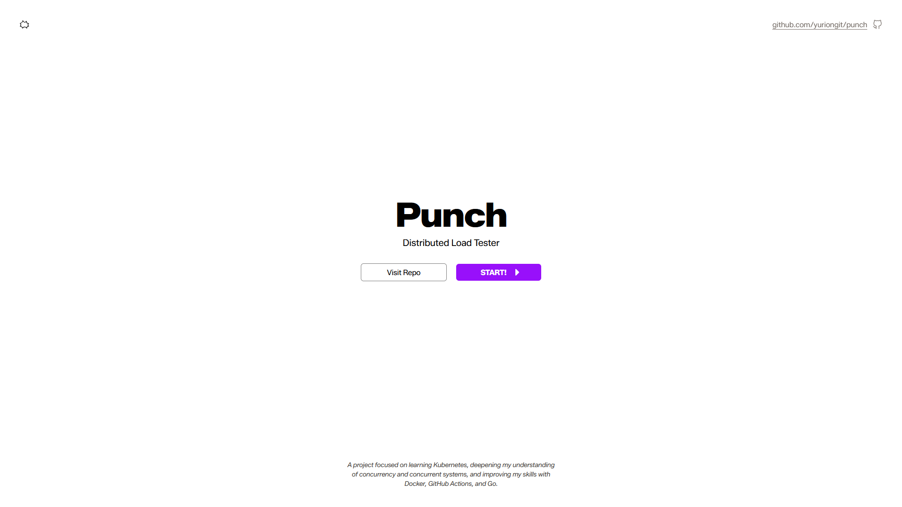

# Punch

Punch is a HTTP load tester. Planned to be available as both a CLI tool 
and web app. Being built to deepen my understanding of Docker, GitHub 
Actions, and handling concurrency with Go.



## Features

...

## Technology

**Web App**

| Layer | Tools |
| --- | --- |
| **Frontend** | React, TypeScript, Vite, Bun |
| **API** | Go, Gin, Docker, Redis |
| **CI/CD & Hosting** | GitHub Actions, Vercel, Railway / GCP |

**CLI**

| Layer | Tools |
| --- | --- |
| **API** | Go, BubbleTea, Docker, Redis |

## Running locally

### Clone the repo

```bash
git clone https://github.com/yuriongit/punch.git
cd punch
```

### Start Frontend

```bash
cd web
bun install --frozen-lockfile
bun run build 
bun run preview
```

### Start API

```bash
go run .
```

## Docs

...

## Status

Work in progress
